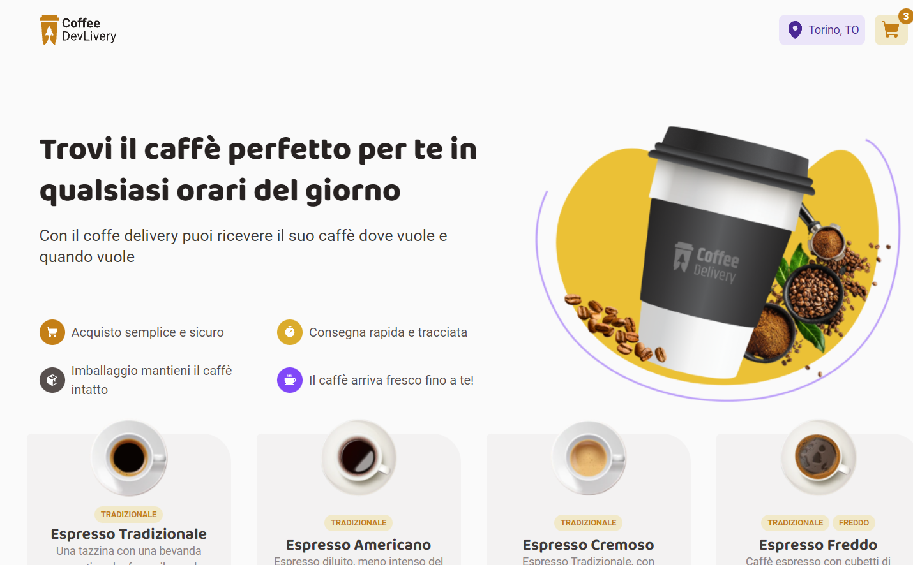

<h1 align="center"> Coffe Delivery</h1>

<p align="center">
  <a href="#tech">Tech</a>&nbsp;&nbsp;&nbsp;|&nbsp;&nbsp;&nbsp;
  <a href="#project">Projeto</a>&nbsp;&nbsp;&nbsp;|&nbsp;&nbsp;&nbsp;
  <a href="#getting-started">Getting Started</a>
</p>

## Project
Live here: https://coffee-delivery-filipesaretta.vercel.app/


## Tech

- React
- Typescript
- Styled-components

## Getting Started

Clone the project and access the folder.

```
git clone https://github.com/filipesaretta/coffeeDelivey

cd search-dev-github
```

Install the dependencies and start.

```
npm install

npm run dev
```

## About Project 

The challenge was to build a coffe delivery shop where you can add and remove items from the cart, save to the localStorage, make a form where you can add the address to send the coffe.
Great to practice handling with states, components and contextAPI.


